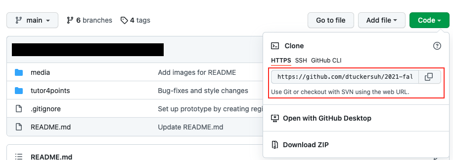
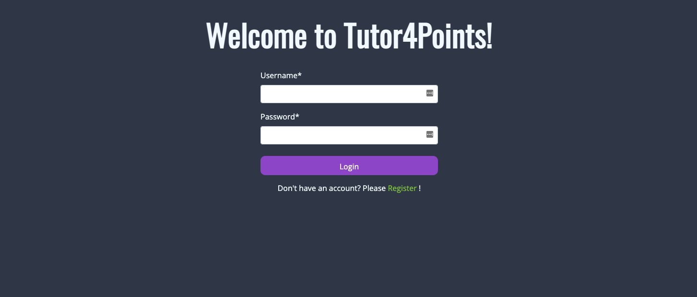
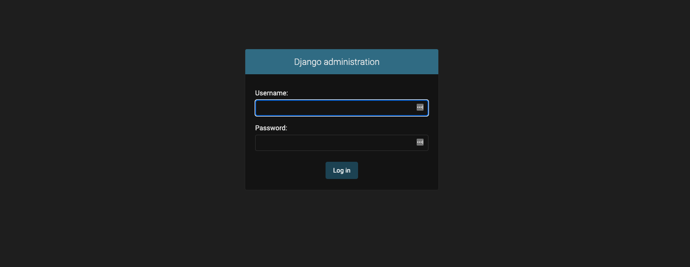
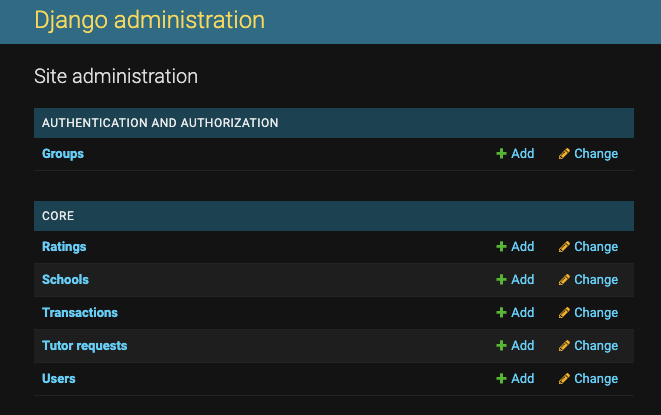
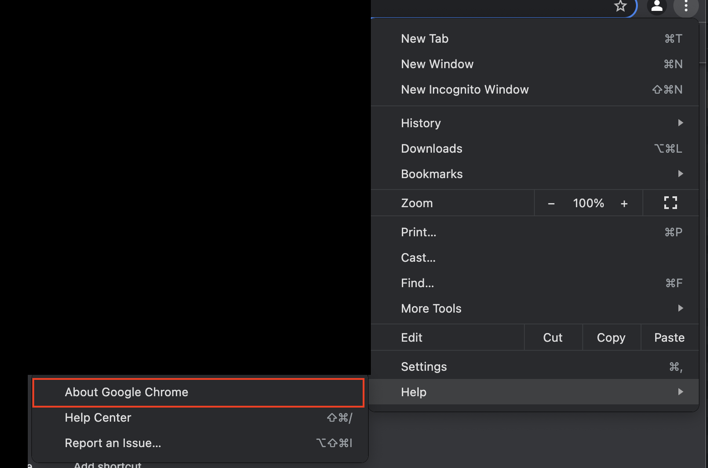
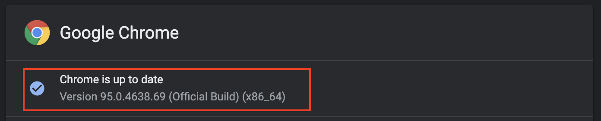
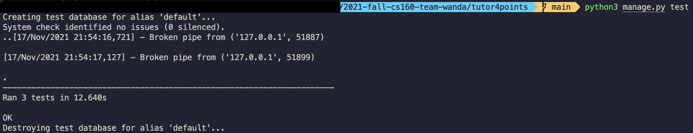

# 2021-fall-cs160-team-wanda

## Downloading Project Dependencies
1. Download python from https://www.python.org/downloads/. If you are a Mac user, it is likely that you already have python installed.
2. The best way to install other project dependencies is through pip. Instructions to install pip can be found here https://pip.pypa.io/en/stable/installation/
3. Install Pillow using ```pip install Pillow```
4. Install Crispy Forms using ```pip install django-crispy-forms```

## Cloning the Project
1. Using Terminal to navigate to the folder where you would like the project to be stored.
2. Copy the URL from the GitHub Repository

4. Clone the project by running the following command in Terminal: ```git clone <url>```

## Running the Project
1. Navigate to ```2021-fall-cs160-team-wanda/tutor4points``` and run ```python3 maange.py migrate```
2. Run the python project setup script ```python3 setup_project.py```
Note: This script adds sample tutors and schools into the database. It also sets up the admin account. 
3. Type ```python3 manage.py runserver```
4. Copy the address into your browser (usually it’s ```http://127.0.0.1:8000/```). It should redirect you to the login page


### Accessing Admin Page
The admin page allows you to see an overview of all the database instances and allows you to add, modify, and delete those instances.
1. Navigate to ```http://127.0.0.1:8000/admin```
2. The page wil prompt you to log into the admin account. The following credentials are set up for the admin account.
Username: admin
Password: wanda

3. After signing in,you will have access to all the database instances.


## Selenium Test Automation
### Downloading & Configuring the Driver
1. Go to Chrome, click Settings > Help > About Google Chrome to check what version your Chrome browser is at.


3. Download the chromedriver that matches the version of your browser: https://chromedriver.chromium.org/downloads <br>
4. Make sure you have selenium installed: https://www.selenium.dev/documentation/getting_started/installing_selenium_libraries/ ( in command line: ```pip install selenium``` <br>
5. Add the driver to your system path
If you have a Mac, you can add the driver to your system by opening Terminal, then typing ```sudo nano /etc/paths```. Type in the path to the folder that contains the webdriver.<br>
### Running the Test
1. Open the project folder and navigate to 2021-fall-cs160-team-wanda/tutor4points. Run the command
```python manage.py test```<br>
2. You should see the driver being activated, the chrome window opening, and buttons being pressed automatically. The test results will be shown after the script is ran<br>


## Running Docker
1. Navigate to ```2021-fall-cs160-team-wanda/tutor4points```
2. Build container image using ```docker build -t tutor4points .```
3. Start container using updated code using ```docker run -p 8000:8000 tutor4points```

## Team Practices
* Every feature is a separate branch and is named in the format ```feature-featurename```
* If more than one person is working on a feature, that particular feature branch can be branched into even smaller branches
* There must be at least 2 code reviews before code is merged into the main branch
* During code reviews, check for code styling as well as check for any bugs. Approve if the the bugs are minor, request changes if there are major bugs or the feature implemented does not align with project vision and requires rework

